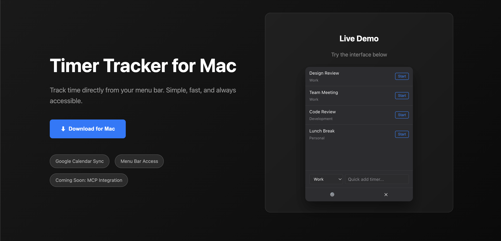

# Dingo Track

<div align="center">
  <a href="https://connerkward.github.io/trak/" target="_blank">
    
  </a>
  <p><em>Dingo Track - Mac menu bar time tracking with Google Calendar integration</em></p>
</div>

A Mac menu bar app for time tracking with Google Calendar integration.

## Features

- **Menu Bar Integration**: Lives in your Mac menu bar for quick access
- **Google Calendar Sync**: Automatically creates calendar events when timers are stopped
- **Persistent Timers**: Timers continue running even if the app is closed or computer is shut down
- **Multiple Timers**: Create and manage multiple named timers
- **Calendar Selection**: Choose which Google Calendar to create events in
- **Settings Management**: Configure timers and calendar visibility
- **Claude Desktop Integration**: Connect with Claude Desktop for natural language timer control

## Getting Started

### Prerequisites

- macOS
- Node.js and pnpm
- Google Calendar API credentials (optional for development)

### Installation

1. Install dependencies:
   ```bash
   pnpm install --ignore-workspace
   ```

2. Build the app:
   ```bash
   npm run build:desktop
   ```

3. Run in development mode:
   ```bash
   npm run dev
   ```

### Google Calendar Setup

**🎉 For End Users (Distributed App):**
- **No setup required!** Just click "Connect Google Calendar" and log into your Google account.
- The app includes pre-configured OAuth credentials for immediate use.

**⚙️ For Developers:**
- OAuth credentials are bundled with the app for distribution
- For development, you can override with your own credentials
- See [GOOGLE_SETUP.md](./GOOGLE_SETUP.md) for development setup

**🔐 Security Note:** 
- End users authenticate through Google's secure OAuth flow
- No credentials are stored locally until you authorize the app

## Usage

### Main Interface

- Click the Dingo Track icon in the menu bar to open the main window
- View all configured timers with start/stop buttons
- Use the quick add form to create new timers
- Access settings and quit the app from the footer

### Settings Window

- Add new timers with custom names and calendar assignments
- Toggle calendar visibility in the main dropdown
- Edit or delete existing timers
- Connect with Claude Desktop

### Claude Desktop Integration

1. Click "Create Claude Desktop Config" in settings
2. Save the generated `.dxt` file
3. Install it in Claude Desktop to enable natural language timer control

## File Structure

```
apps/dingo-track/
├── desktop/                 # Electron main process
│   ├── main.ts             # App entry point and window management
│   ├── preload.js          # IPC bridge between main and renderer
│   ├── googleCalendarService.ts  # Google Calendar API integration
│   ├── timerService.ts     # Timer logic and persistence
│   └── mcp-server.js       # Claude Desktop MCP server
├── src/                    # React components
│   ├── App.jsx             # Main timer interface
│   ├── Settings.jsx        # Settings window
│   ├── App.css             # Main app styles
│   ├── Settings.css        # Settings styles
│   ├── index.html          # Main window HTML
│   └── settings.html       # Settings window HTML
├── assets/                 # Icons and resources
└── package.json           # Dependencies and scripts
```

## Development

The app uses:
- **Electron** for the desktop wrapper and menu bar integration
- **React** for the user interface
- **TypeScript** for type safety in the main process
- **Google APIs** for calendar integration
- **electron-store** for persistent data storage

### Key Components

- **TimerService**: Manages timer state, persistence, and calendar event creation
- **GoogleCalendarService**: Handles OAuth and Google Calendar API calls
- **Main Process**: Manages windows, tray icon, and IPC communication
- **React Components**: Provide the user interface for timer management

## Building for Production

### Unsigned Build (Testing Only)

```bash
npm run dist:mac
```

**Note:** Users will get "developer cannot be verified" warning. See workaround in CODE_SIGNING.md.

### Signed & Notarized Build (Production)

Requires Apple Developer account ($99/year). See [CODE_SIGNING.md](./CODE_SIGNING.md) for complete setup.

1. Set up code signing (one-time):
   - Create Developer ID certificate
   - Configure environment variables in `.env` (copy from `env.template`)
2. Build:
   ```bash
   npm run dist:mac
   ```

This will:
1. Compile TypeScript files
2. Sign the app with your Developer ID
3. Package the Electron app
4. Notarize with Apple (takes 2-10 minutes)
5. Create a distributable `.dmg` file

## License

This project is part of the every-time monorepo.